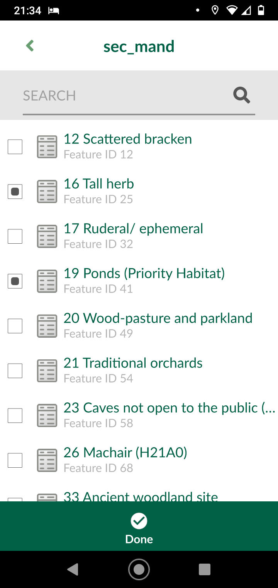
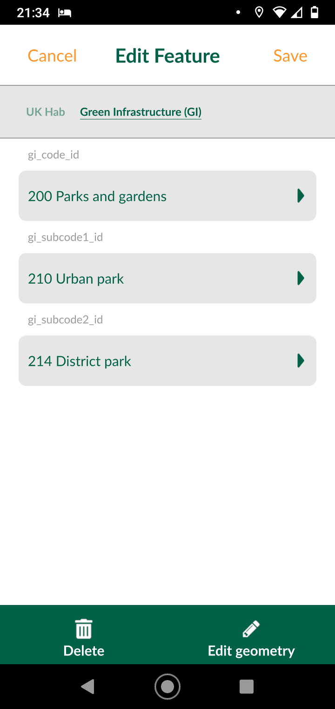

# UK Habitat Classification Survey

This is an example template GeoPackage[1](#f1) for recording data for the [UK habitat classification](https://ukhab.org/) in field survey applications such as [Qfield](https://qfield.org/) or [Input](https://inputapp.io).

***Note: this is only a proof of concept. Additonal styling and optimisation may be required. Feel free to modify as you wish.***

## Features 

+ Combo-box filtering e.g. level 3 box will only show subset of level 2 box that match
+ Multi-selection of secondary codes.
+ Forms and style built entirely in QGIS so styling and forms will carry over onto the surveying app.
+ Designed as a relational database such that base tables can be easily updated as new categories are added.

+ Automated UK Hab Code generator making use of internal GeoPackage triggers

# QGIS and Mobile mapping

Download the GeoPackage[1](#f1) (**.gpkg** file) and try out in [QGIS](https://qgis.org/) or take a look at an example project in *Input* to see how the app works in the field (a [Mergin](https://public.cloudmergin.com) account is required first).  

Once signed into *Input* on your mobile device, search for:

**ypp-dhinchley/uk-hab-public**

Feel free to test it out and add survey points!

  
   
  

---

<a name="f1">[1]</a>: Not sure what a "GeoPackage" is? Check out [this](https://www.gis-blog.com/geopackage-vs-shapefile/) and [this](http://switchfromshapefile.org/).
